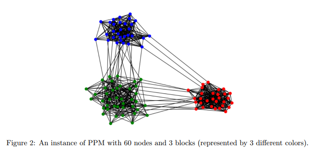
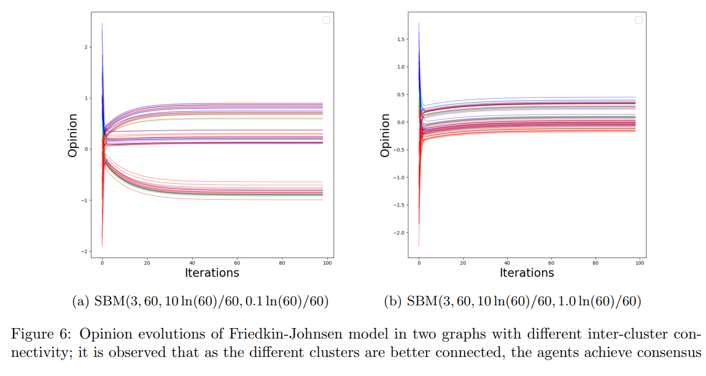

# Simulation of Opinion Dynamics on Social Networks

## Abstract
In this project, we study how the structure of social network influence the way that individuals' opinions evolve. We consider the two popular opinions dynamics models, namely the Friedkin-Johnsen model and the Hegselamnn-Krause model, and perform simulations on networks generated by stochastic block models, to observe how the community structure of the graph affects the convergence time, polarization and disagreement, etc. of the steady-state opinions.

## Results
For the Friedkin-Johnsen models, we observe that _as the different communities in a network are better connected, the polarization and disagreement of steady-state opinions decrease, and vice versa_. However, for Hegselmann-Krause model, we did not observe a clear pattern in polarization or disagreement scores in terms of community structure. We speculate that the reason behind this observation is due to emergence of stubborn agents, of when and why we leave for future works.

## Further information
For more detailed results, feel free to refer to the PDF report attached. The Python script for simulation is provided in the Jupyter Notebook attached, which uses `NetworkX` and `NDlib`.

## Example: Friedkin-Johnsen opinion dynamics on two different SBMs

